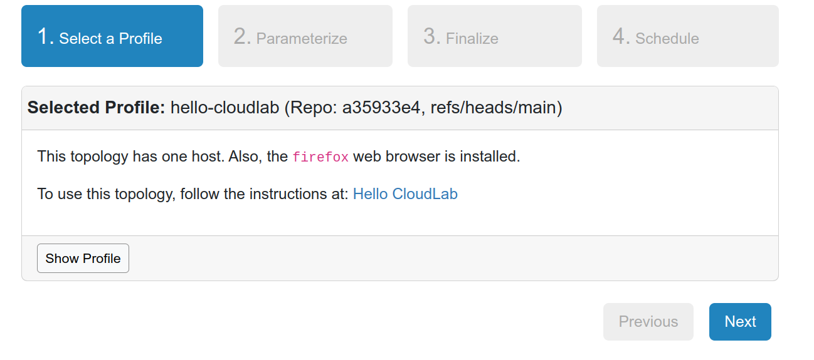
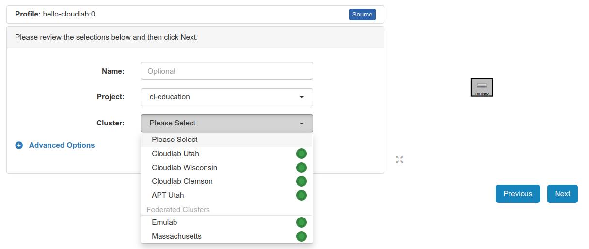
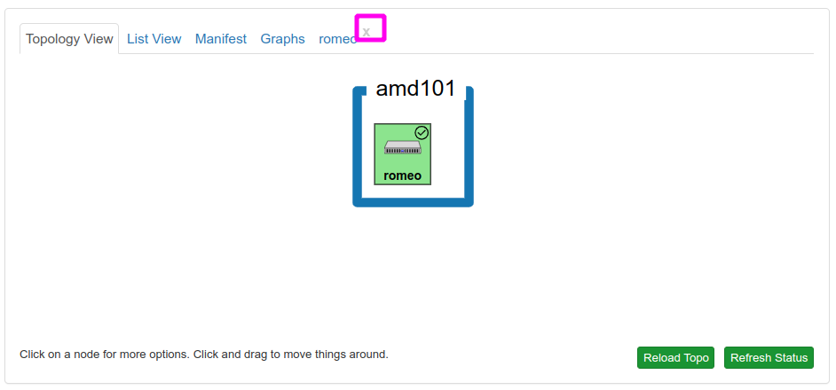
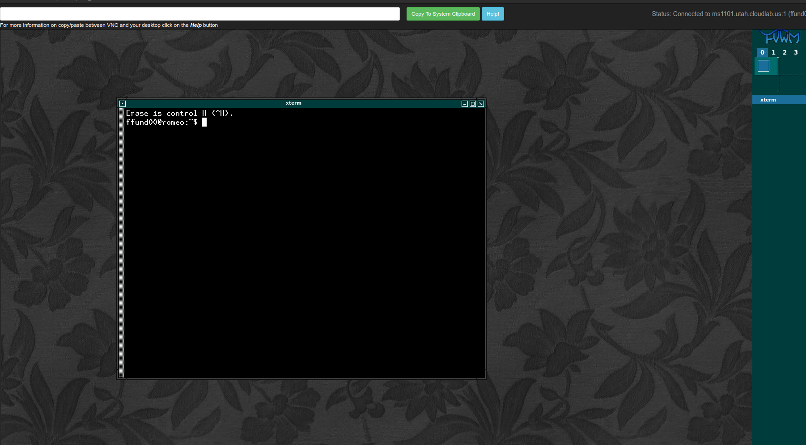
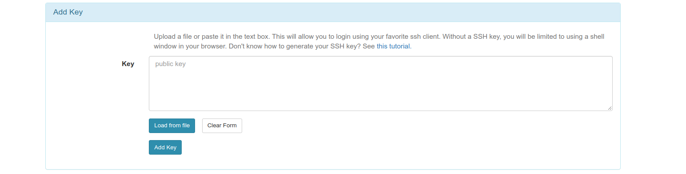

# Hello, CloudLab

In this tutorial, you will learn how to use CloudLab to run experiments in computer networks or cloud computing. It should take you about 60-90 minutes of *active* time to work through this tutorial.

> **Note**
> This process has a "human in the loop" approval process - you'll need to wait for your instructor or research advisor to approve your request to join their project. Be prepared to start the tutorial, wait for this approval, and then continue. 


CloudLab is a "virtual lab" for experiments on networking, cloud computing, and distributed systems. It allows experimenters to set up real (not simulated!) end hosts and links at one or more CloudLab host sites located around the United States. Experimenters can then log in to the hosts asociated with their experiment and install software, run applications to generate traffic, and take network measurements.

Before you can run lab experiments on CloudLab, you will need to set up an account. Once you have completed the steps on this page, you will have an account that you can use for future experiments.


## Prepare your workstation

You'll need to prepare your workstation (the laptop or PC you are going to use for your experiments) with a suitable terminal application.


### Terminal software

To use CloudLab, the primary software application you'll need is a terminal, which you will use to log in to remote hosts over SSH and carry out various exercises.

You may have a terminal application already on your workstation, but it may not be ideal for this purpose. When you run experiments on remote hosts, you will often have to run and monitor the output of multiple commands in several independent terminal sessions. It is therefore recommended to use a terminal that lets you split one terminal window into multiple panes - for example,

* [cmder](https://cmder.net/) for Windows. (Get the full version, not the mini version.)
* [iTerm2](https://www.iterm2.com/) for Mac
* [terminator](https://launchpad.net/terminator) for Linux

Once you have downloaded and installed your terminal application, open it up and practice using it. Make sure you know:

* How to split the pane in your terminal. 
* How to copy text from your terminal and paste into another application. This will be helpful when you need to save some terminal output for your lab report.
* How to copy text from another application and paste into your terminal. This will be helpful when you need to copy a command from the lab instructions into your terminal, in order to run it.

#### cmder on Windows

If you are using cmder on Windows, you can split the pane as follows:

1. Click on the green + symbol near the bottom right side of the window. This will open a "Create new console" dialog.
2. Where it says "New console split", choose "to bottom" or "to right". You can leave other options at their default settings.
3. Click "Start".

Note that if you need to split more than once, click on the pane that you want to split (so that it is the active pane) before using the green + symbol to split it again. 

To copy text from the terminal, select the text you want to copy. It will be automatically copied to your clipboard, and you can then paste it into any other application.

To paste text into the terminal, place your cursor where you want to paste, and right click.


#### iTerm2 on Mac

If you are using iTerm2 on Mac, you can split the pane as follows:

1. To create a new vertical pane, use ⌘+D
2. To create a new horizontal pane, use ⌘+Shift+D

To copy text from the terminal, select the text you want to copy and use ⌘+C to copy.

To paste text into the terminal, place your cursor where you want to paste, and use ⌘+V to paste.

#### Terminator on Linux

If you are using `terminator` on Linux, you can split the pane either vertically or horizontally as follows:

1. Right-click anywhere inside the terminal window
2. Choose "Split pane horizontally" or "Split pane vertically"
3. You can resize panes by dragging the divider between panes

To copy text from the terminal, select the text you want to copy and either

* right-click, and choose Copy, or
* use Ctrl+shift+C to copy

To paste text into the terminal, place your cursor where you want to paste, and either

* right-click, and choose Paste, or
* use Ctrl+shift+P to paste

### Wireshark

Wireshark is a software application for capturing, viewing, and analyzing network packets. This experiment doesn't use Wireshark, but you may need it in future experiments.

Download Wireshark from [the Wireshark website](https://www.wireshark.org/download.html).

Then, follow the instructions to install for your system:

* [Instructions for installing Wireshark on Windows](https://www.wireshark.org/docs/wsug_html_chunked/ChBuildInstallWinInstall.html). (Note: you only need Wireshark, not the extra components that are bundled along with it.)
* [Instructions for installing Wireshark on Mac](https://www.wireshark.org/docs/wsug_html_chunked/ChBuildInstallOSXInstall.html).
* [Instructions for installing Wireshark on Linux](https://www.wireshark.org/docs/wsug_html_chunked/ChBuildInstallUnixInstallBins.html).


## Set up your account on CloudLab

Now that you have the software you need, you are ready to set up an account on CloudLab.

### Exercise - Set up SSH keys

In this exercise, you will set up a pair of SSH keys with which you will access resources on CloudLab. (If you have previously used SSH keys, and have a public and private key ready to use, you can skip to the next exercise.)

CloudLab users access resources using *public key authentication*. Using SSH public-key authentication to connect to a remote system is a more secure alternative to logging in with an account password.

SSH public-key authentication uses a pair of separate keys (i.e., a key pair): one "private" key, which you keep a secret, and the other "public". A key pair has a special property: any message that is encrypted with your private key can only be decrypted with your public key, and any message that is encrypted with your public key can only be decrypted with your private key.

This property can be exploited for authenticating login to a remote machine. First, you upload the public key to a special location on the remote machine. Then, when you want to log in to the machine:

1. You use a special argument with your SSH command to let your SSH application know that you are going to use a key, and the location of your private key. If the private key is protected by a passphrase, you may be prompted to enter the passphrase (this is not a password for the remote machine, though.)
2. The machine you are logging in to will ask your SSH client to "prove" that it owns the (secret) private key that matches an authorized public key. To do this, the machine will send a random message to you.
3. Your SSH client will encrypt the random message with the private key and send it back to the remote machine.
4. The remote machine will decrypt the message with your public key. If the decrypted message matches the message it sent you, it has "proof" that you are in possession of the private key for that key pair, and will grant you access (without using an account password on the remote machine.)

(Of course, this relies on you keeping your private key a secret.)

On your laptop, you're going to generate a key pair and upload the public key to the CloudLab portal. Then, you'll use that key from now on to log in to CloudLab resources. Open a Bash terminal (such as `cmder` in Windows, or the built-in terminal in Mac or Linux).

Generate a key with:

```
ssh-keygen -t rsa
```

and follow the prompts to generate and save the key pair. The output should look something like this:

```
$ ssh-keygen -t rsa
Generating public/private rsa key pair.
Enter file in which to save the key (/users/ffund01/.ssh/id_rsa): 
Enter passphrase (empty for no passphrase): 
Enter same passphrase again: 
Your identification has been saved in /users/ffund01/.ssh/id_rsa.
Your public key has been saved in /users/ffund01/.ssh/id_rsa.pub.
The key fingerprint is:
SHA256:z1W/psy05g1kyOTL37HzYimECvOtzYdtZcK+8jEGirA ffund01@example.com
The key's randomart image is:
+---[RSA 2048]----+
|                 |
|                 |
|           .  .  |
|          + .. . |
|    .   S .*.o  .|
|     oo. +ooB o .|
|    E .+.ooB+* = |
|        oo+.@+@.o|
|        ..o==@ =+|
+----[SHA256]-----+
```

In a safe place, make a note of:

* The passphrase you used,
* The full path to your private key (`/users/ffund01/.ssh/id_rsa` in the example above) - copy and paste this from your terminal output,
* The full path to your public key, which has the same name as your private key but with a `.pub` extension (`/users/ffund01/.ssh/id_rsa.pub` in the example above) - copy and paste this from your terminal output.

If you forget these, you won't be able to access resources on CloudLab from your terminal - so hold on to this information!

### Exercise - Create an account

> **Note** 
> To complete this step, you'll need to know the **Project Name** of the project that you will join. Your instructor or research advisor will tell you the project name to use.


First, go to [https://cloudlab.us](https://cloudlab.us) and click on "Request an Account".  You will see a form, like this one:


You will fill in:

* your desired username (by convention, this should be lowercase, and have no spaces or special characters), 
* your full name, school email address, and country, state, and city. 
* For "Institutional Affiliation", you will use the name of your college or university (your instructor may specify the exact text you should use).

Click on the "Choose File" button in the *SSH Public Key file* section, and upload your public key from the previous step. Your public key is the one with the `.pub` file extension.

> **Note**: If you are having trouble uploading your public key to the portal because you aren't able to find it in the file browser, you can copy it to a more convenient location and upload it from there.
>
> * Open a terminal.
> * Run `cp /path/to/key.pub /path/to/new/location` but substituting the path to your key and the path to a more convenient location (e.g. your Desktop) for the two arguments.
> * Upload the public key from the new location.
> * You can delete the copy of the public key from the new location (the original key is still located at the original location).


In the "Password" field, enter the password you want to use to log in to the CloudLab web portal. Then, in the "Confirm Password" field, enter the same password again.

In the Project Information section, select "Join Existing Project". Then, in the "Project Name" field, enter the project name that your instructor or research advisor gave you.

Keep an eye on your email inbox (including the Spam folder!) for:

* an email asking you to confirm your account registration. You'll need to click on a link in this email to continue setting up your account.
* an email letting you know that your instructor or research advisor approved your request to join their project.

Now you have a CloudLab account - you're ready to log in and use it to get experiment resources!

## Reserve and log in to resources on CloudLab

Whenever you run an experiment on CloudLab, you will

1. Open the *profile* - a description of the experiment resources (hosts and network links) that your experiment will use. Submit a request to "instantiate" that configuration for use in your experiment.
2. Wait until the resources in your experiment are ready to log in.
3. Log in to the resources and run your experiment.

Also, when you finish an experiment and have saved all the data somewhere safe, you will _delete_ the resources in your experiment to free them for use by other experimenters.

### Exercise - Open and instantiate a profile

For this experiment, we will use the CloudLab profile available at the following link: https://www.cloudlab.us/p/cl-education/hello-cloudlab

You'll see a brief description of the profile:



Click "Next". On the following page, you'll see a diagram of your experiment topology (on the right - in this case, a single host named "romeo"),
and on the left you'll be asked to select the "Cluster" on which you want your experiment to run:



Unless otherwise specified, these experiments can run on any cluster. However, since CloudLab is a shared resource, on some occasionas the cluster you select might not have enough available resources to support your experiment. The status indicator next to each cluster tells you roughly how heavily utilized it is at the moment - green indicates that there are not many users, orange means heavy load, and red means that it is almost fully utilized. You are more likely to be successful if you choose a cluster with a green indicator.

After you select a cluster, you can leave the "Name" field blank, or give your experiment a name - it's your choice. Also make sure your "Project" is selected. Then, click "Next".


On the last page, you'll be asked to set the duration of your experiment. At the end of this duration, your resources will be deleted automatically - so make sure to give yourself enough time to finish.

You can leave the start date/time on this page blank if you are ready to work on the experiment right now. 

When you have made all your choices, click "Finish" to ask CloudLab to reserve resources according to your configuration.

### Exercise - Wait for resources to be ready 

Once you have successfully instantiated a profile, it will still take some time before your resources are ready for you to log in.

As your resources come online, you'll see their progress on the CloudLab experiment page:


As time passes, you will see a diagram of your experiment, but initially the hosts in the experiment will be colored yellow - this indicates that they're not ready to use yet. There's also a small "⊝" icon in the top right corner of the host - this indicates that it is not yet fully configured.


It can take a while for hosts to boot up and load their configurations - you may want to step away or work on something else for 15-20 minutes and then check back.

At some point, the host will turn green, but it may have a "⊙" icon in the top right - this indicates that it is still being configured.


Eventually, the host will be "green" with a "✓" icon in the top right corner. This shows that it is ready to use, and you can go on to the next step.


> **What if it fails?** If the CloudLab site is unable to bring up the resources you requested, the hosts will turn red instead of green. If this happens, delete the resources (use the red "Terminate" button). Then, try to reserve your resources again - you may want to try a different cluster, in case the problem was with the specific cluster that you used.

### Exercise - Log in to resources

Once the host in your experiment is "green" and has a "✓" icon in the top right corner, it is ready for you to log in! In this exercise, you'll practice accessing the host three ways:

* Using the terminal in the CloudLab web portal
* Using your own terminal application
* Using VNC (for a graphical interface)

#### Using the terminal in the CloudLab web portal

The CloudLab web interface includes a terminal utility with which you can access a "shell" and run commands on any host in your experiment. To access it, click on the host and choose "Shell" from the menu:


This will open a new "tab" in the CloudLab experiment page, with the same name as the hostname. At this tab, you'll have an interactive terminal session on the host. You can type commands into this terminal session and see the output.


Try typing

```
echo "Hello world"
```

in this terminal shell, and observe the output.


It's helpful to know how to copy and paste from/to this terminal. (For some experiments, you may want to copy commands from the instructions and paste them directly into the terminal. You may also want to copy command output from the terminal into your notes or a lab report.)

* Try selecting the `echo` command above and copying it. Then, right click in the shell you have open on the "romeo" host and select "Paste".
* Try selecting a few lines of text in the shell, then right click and select "Copy". Open a text editor or document editor, and paste the text you have copied.

When you are done using this shell, you can close it using the "x" icon on the tab:



#### Using your own terminal application

The terminal in the CloudLab web portal is handy, but you may find it more convenient to use your own terminal. 

Click on the "List view" tab, and note the line corresponding to the host you want to access - in this case, the host named "romeo".  Copy the text in the "SSH" command section:


Note that this text is a hyperlink, and will prompt you to open an application if you click on it. *Don't* click on it - just select it and copy it.

Open the terminal application you installed earlier (e.g. `cmder`, `iTerm2`), and paste this SSH command into the terminal window, but don't run it yet!


If you have saved your SSH key in the default location, this command will work directly. But if you specified a non-default location for your SSH key, you'll need to modify the command to include the path to your own SSH key. (You should have noted this path in "Exercise - Set up SSH keys.")

In your terminal, add a `-i` and then the path to your SSH key just after the word `ssh` in the command. For example, if my key was located in, `~/.ssh/id_rsa`, I would use


Then, hit Enter to run the command. 

The first time you log in to each new host, your computer may display a warning similar to the following:

```
The authenticity of host '[amd101.utah.cloudlab.us]:25107 ([206.196.180.202]:25107)' can't be established.
RSA key fingerprint is SHA256:FUNco2udT/ur2rNb2NnZnUc8s2v6xvNdOFhFFxcWGYA.
Are you sure you want to continue connecting (yes/no)?
```

and you will have to type the word `yes` and hit Enter to continue. If you have specified your key path and other details correctly, it won't ask you for a password when you log in to the node. (It may ask for the _passphrase_ for your private key if you've set one.)

Try typing

```
echo "Hello world"
```

in this terminal shell, and observe the output. Then, you can type 

```
exit
```

to close the terminal session.

#### Using VNC

Finally, you can also get a graphical user interface on the remote host using a remote access protocol called VNC.

In the "Topology view" tab, click on the host again, and choose the option to "Open VNC Window".


> **Note**
> The availability of this option depends on the experiment topology and configuration - some CloudLab experiments will have the VNC option, but some will not.

This will open a new window with a graphical user interface running on the remote host:



At first, you'll just see a terminal. But you can install and run graphical applications here, too. For example, type

```
firefox
```

at the terminal inside the VNC window, to open a browser *running on the remote host*.


When you are done with your VNC session, you can just close the application window.

### Release resources

Part of being a good CloudLab citizen is releasing resources when you're not using them anymore. When you have finished everything you need to do in an experiment and retrieved all data from your remote hosts, use the "Terminate" button  to delete your resources and free them for other experimenters.


Once you delete your resources, you will no longer have access to them, and any data on them will be deleted. Make sure that you have saved *everything* before you delete your resources.


## Appendix - view, edit, or add keys on CloudLab

The SSH keys you have set up in this tutorial will allow you to access CloudLab resources from only one device - the device that your key pair is on. If you need to access CloudLab resources from another PC or laptop, you'll need to generate additional keypairs and associate them with your CloudLab account. 

To set up a key pair on another device:

* Follow the instructions in the section titled "Exercise - Set up SSH keys" to generate a key pair on this new device.
* Log in to the CloudLab web portal, and open the [Manage SSH Keys](https://www.cloudlab.us/ssh-keys.php) page from the user menu. Scroll to the "Add Key" section of this page:



Select "Load from file" and in the file browser, select the public part of your key pair (it has a `.pub` extension.) The text of your public key will appear in the "Key" section. Click "Add Key".

Note that if you need to use CloudLab from more than one device, you can have multiple keys associated with your account! You don't have to delete your other keys.

Once your key is in the CloudLab web portal, every time you reserve CloudLab resources, your key will automatically be placed in the "authorized keys" list so that you can access the resource. 


---

<small>Questions about this material? Contact Fraida Fund</small>

<br><br>

<small>This material is based upon work supported by the National Science Foundation under Grant No. 2231984.</small>
<small>Any opinions, findings, and conclusions or recommendations expressed in this material are those of the author(s) and do not necessarily reflect the views of the National Science Foundation.</small>
